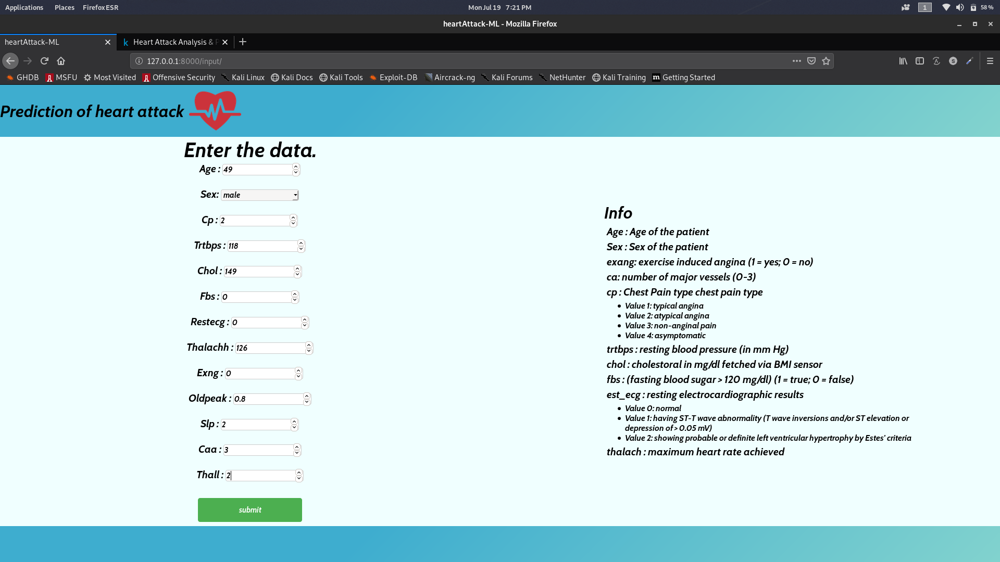
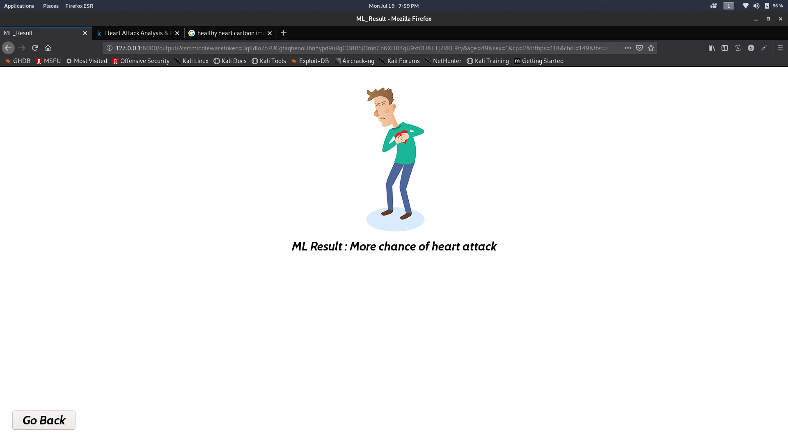
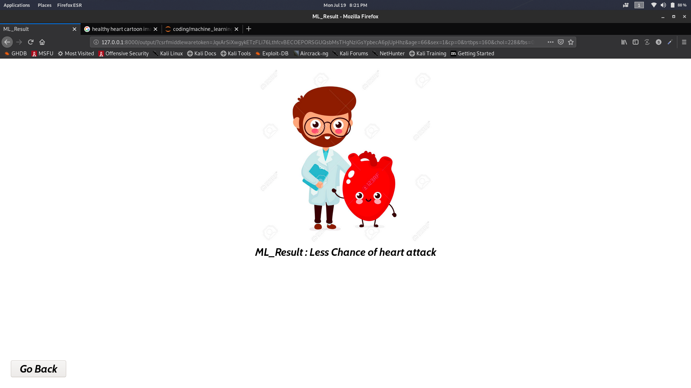

# Prediction-of-heart-attack-ML
<h2>Prediction Website made using Django and machine learning</h2><br>
<p>hope you have installed django or else you can follow the command</p><br>
python -m pip install Django
<br>
<h3>Create the project</h3>
django-admin startproject heartattack
<br>
<p>change the directory to the new project folder created</p>
<p>Then create the app for the project</p>
python manage.py startapp heartattackML
<br>
<p>For quick overview of the project you can copy and overwrite the files and folder from the repo to the respective files of django that you have created</p>
<h3>How to run the django server</h3>
python manage.py runserver

<h2>Machine Learning Model</h2>
<p>The model used here is Logistic Regression with an accuracy of 88 %</p>
<p>The dataset taken from the link below</p>
https://www.kaggle.com/rashikrahmanpritom/heart-attack-analysis-prediction-dataset

<h2>Integration of model with django</h2>

<h2>Machine Learning model used</h2>
<p>Logistic Regression (model.py)</p>

```python
import numpy as np
import pandas as pd
import matplotlib.pyplot as plt
import seaborn as sns
from sklearn.impute import SimpleImputer
from sklearn import preprocessing
from sklearn.compose import ColumnTransformer
import joblib


dataset = pd.read_csv('/kaggle/input/heart-attack-analysis-prediction-dataset/heart.csv')

x = dataset.iloc[:,:-1].values
y = dataset.iloc[:,-1].values

from sklearn.model_selection import train_test_split
x_train,x_test,y_train,y_test = train_test_split(x,y,test_size = 0.25,random_state = 102)

from sklearn.preprocessing import StandardScaler
sc_x = StandardScaler()
x_train = sc_x.fit_transform(x_train)
x_test = sc_x.transform(x_test)

from sklearn.linear_model import LogisticRegression
classifier = LogisticRegression()
classifier.fit(x_train,y_train)

print('accuracy is ', classifier.score(x_test,y_test)*100,'%') #Accuracy is   0.881578947368421

#saving the model
filename = 'ml_model.sav'
joblib.dump(classifier,filename)
```
<p>joblib module of python is used to create an instance of the model so that we can use it in django as a .sav file</p>

<p>django (views.py)</p>

```python

from django.shortcuts import render

# Create your views here.
from django.shortcuts import render
import joblib
from sklearn import preprocessing
import pandas as pd
import numpy as np
# Create your views here.
def input_view(request):
    return render(request,"ml/input.html")

def res_view(request):
    clss = joblib.load('model/ml_model.sav')
    lis = []
    lis.append(request.GET['age'])
    lis.append(request.GET['sex'])
    lis.append(request.GET['cp'])
    lis.append(request.GET['trtbps'])
    lis.append(request.GET['chol'])
    lis.append(request.GET['fbs'])
    lis.append(request.GET['restecg'])
    lis.append(request.GET['thalachh'])
    lis.append(request.GET['exng'])
    lis.append(request.GET['oldpeak'])
    lis.append(request.GET['slp'])
    lis.append(request.GET['caa'])
    lis.append(request.GET['thall'])
    
    lis = list(map(float,lis))
    lis = np.resize(lis,(1,13))
    
    dataset = pd.read_csv('model/heart.csv')
    df = pd.DataFrame(dataset)
    x = df.iloc[:,:-1].values
    x = np.append(x,lis,axis=0)
    
    sc_x = preprocessing.StandardScaler()
    sc_input = sc_x.fit_transform(x)
    sc_input = sc_input[-1]
   
    ans = clss.predict([sc_input])
    
    result = ['Less Chance of heart attack','More chance of heart attack']
    i = ans[0]
    res = result[i]
    return render(request,"ml/output.html",{'pred': res,'i':i})
```
<h3>res_view() function in views.py gets the input from the website(user) and predict the output and pass the result as a context variable </h3>

<p>django (urls.py)</p>

```python
from django.contrib import admin
from django.urls import path
from heartattackML.views import input_view,res_view
urlpatterns = [
    path('admin/', admin.site.urls),
    path('input/',input_view,name = 'input'),
    path('output/',res_view,name = 'output')
]
```
<p>These paths in urls.py will connect different pages of your website</p>

<p>django (settings.py)</p>

```python
import os

INSTALLED_APPS = [
    'django.contrib.admin',
    'django.contrib.auth',
    'django.contrib.contenttypes',
    'django.contrib.sessions',
    'django.contrib.messages',
    'django.contrib.staticfiles',
    'heartattackML',
]

STATICFILES_DIRS = [
    os.path.join(BASE_DIR, "static"),
]

TEMPLATES = [
    {
        'BACKEND': 'django.template.backends.django.DjangoTemplates',
        'DIRS': [os.path.join(BASE_DIR,"templates")],
        'APP_DIRS': True,
        'OPTIONS': {
            'context_processors': [
                'django.template.context_processors.debug',
                'django.template.context_processors.request',
                'django.contrib.auth.context_processors.auth',
                'django.contrib.messages.context_processors.messages',
            ],
        },
    },
]

MEDIA_ROOT = os.path.join(BASE_DIR,'model')
MEDIA_URL = '/model/'
```
<h3>Add these additional segments in settings.py of django will helps to link your static folders and model folder where you kept all your css & html files , sav files , csv files etc. It make your template folder global </h3> 

<h3>Screen shots of the website input page and output page</h3>
<p>input.html</p>




<p>input.html code</p>
    
```html

<!DOCTYPE html>
<html lang="en">
<head>
    <meta charset="UTF-8">
    <meta name="viewport" content="width=device-width, initial-scale=1.0">
    <title>heartAttack-ML</title>
    <link rel="stylesheet" href="">
</head>
<body>
    <div class="body_head">
        <h1>Prediction of heart attack</h1>
        
    </div>
    <div class="body">
        <div class="body_left">
            <h1>Enter the data.</h1>
            <form action="">
                Age : <input type="number" required name="age"><br><br>
                <label for="sex">Sex:</label>
                <select name="sex">
                    <option value="1">male</option>
                    <option value="0">female</option>
                </select>
                <br>
                <br>
                Cp : <input type="number" required name="cp" step="any"  min = '0' max = '3'><br><br>
                Trtbps : <input type="number" required name="trtbps" step="any" ><br><br>
                Chol : <input type="number" required name="chol" step="any" ><br><br>
                Fbs : <input type="number" required name="fbs" step="any"  min = '0' max = '1'><br><br>
                Restecg : <input type="number" required name="restecg"  step="any" min = '0' max = '2'><br><br>
                Thalachh : <input type="number" required name="thalachh" step="any" ><br><br>
                Exng : <input type="number" required name="exng" step="any"  min = '0' max = '1'><br><br>
                Oldpeak : <input type="number" required name="oldpeak" step="any" ><br><br>
                Slp : <input type="number" required name="slp" step="any" min = '0' max = '2'><br><br>
                Caa : <input type="number" required name="caa" step="any" min = '0' max = '4'><br><br>
                Thall : <input type="number" required name="thall" step="any" min = '0' max = '3'><br><br>
        
                <input type="submit" name="" value="submit">
            </form>
        </div>
        <div class="body_right">
            <div class="body_right_info">
                <h1>Info</h1>
                <p>Age : Age of the patient</p>
                <p>Sex : Sex of the patient</p>
                <p>exang: exercise induced angina (1 = yes; 0 = no)</p>
                <p>ca: number of major vessels (0-3)</p>
                <p>cp : Chest Pain type chest pain type</p>
                <ul>
                    <li>Value 1: typical angina</li>
                    <li>Value 2: atypical angina</li>
                    <li>Value 3: non-anginal pain</li>
                    <li>Value 4: asymptomatic</li>
                </ul>
                <p>trtbps : resting blood pressure (in mm Hg)</p>
                <p>chol : cholestoral in mg/dl fetched via BMI sensor</p>
                <p>fbs : (fasting blood sugar > 120 mg/dl) (1 = true; 0 = false)</p>
                <p>est_ecg : resting electrocardiographic results</p>
                <ul>
                    <li>Value 0: normal</li>
                    <li>Value 1: having ST-T wave abnormality (T wave inversions and/or ST elevation or depression of > 0.05 mV)</li>
                    <li>Value 2: showing probable or definite left ventricular hypertrophy by Estes' criteria</li>
                </ul>
                <p>thalach : maximum heart rate achieved</p>
            </div>
        </div>
    </div>
    
</body>
</html>
```
<p>output.html</p>





<p>output.html code</p>

```html

<!DOCTYPE html>
<html lang="en">
<head>
    <meta charset="UTF-8">
    <meta name="viewport" content="width=device-width, initial-scale=1.0">
    <title>ML_Result</title>
    <link rel="stylesheet" href="">
</head>
<body>
    <div class="res_body">
        
        
        <p>ML Result :  {{pred}}</p>
        
        
        <p>ML_Result :  {{pred}}</p>
        
    </div>
<button><a href="">Go Back</a></button>
</body>
</html>
```
